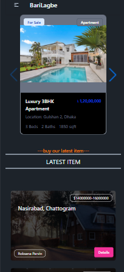
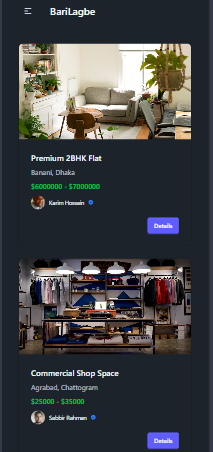
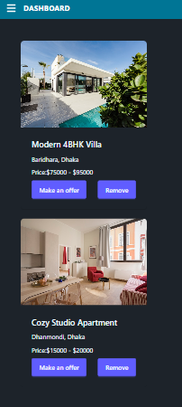

<div align="center">

# 🏠 BariLagbe
### *Find Your Dream Home — Buy, Sell & Manage Properties*

(./src/assets/screenshots/banner.png)

[Live Site](https://bari-lagbe-ruby.vercel.app)

</div>

---

## What is BariLagbe?

**BariLagbe** (বাড়ি লাগবে) is a real estate platform where agents list properties, users discover and negotiate their dream home, and admins keep everything running smoothly — all in one place.

---

##  How It Works

```
Agent Posts Property
        ↓
Admin Reviews →  Approve  or   Reject
        ↓
Property Goes Live on the Platform
        ↓
User Browses & Adds to Wishlist
        ↓
User Makes an Offer (within agent's price range)
        ↓
Agent Reviews Offer →  Accept  or   Decline
        ↓
User Pays & Property is Sold 
```

---

##  Three Roles, One Platform

###  User
-Authentication system
- Browse all verified properties
- Add properties to personal **Wishlist**
- Make a **price offer** within the agent's listed range
- Pay online after offer is accepted
- Track purchased properties from dashboard

###  Agent
- Post new property listings with details & images
- Wait for **Admin approval** before going live
- View all incoming **offers from users**
- Accept or decline offers
- Track sold properties

###  Admin
- Review all **pending properties** from agents
- **Approve** listings to make them public
- **Reject** inappropriate or incomplete listings
- View and manage all **Users & Agents**
- Promote a User → Agent or demote Agent → User
- Full platform oversight from admin dashboard

---

##  Screenshots

| Home | Properties | Wishlist |
|---|---|---|
|  |  |  |

| Agent Dashboard | Admin Dashboard | Payment |
|---|---|---|
|  |  |

---

##  Built With

**Frontend**
- React + React Router
- Tailwind CSS + DaisyUI
- TanStack Query (data fetching)
- Firebase Authentication
-toast
**Backend**
- Node.js + Express.js
- MongoDB 
- JWT (HTTP-only cookies)
- Stripe (payment)

---

##  Run Locally

```bash
git clone https://github.com/your-username/barilagbe-client.git
cd barilagbe-client
npm install
npm run dev
```
---

##  Security Highlights

- JWT stored in **HTTP-only cookies** — safe from XSS
- Role-based route guards on both frontend and backend
- Admin-only APIs verified server-side
- Stripe handles all payment data — no card info stored

---

<div align="center">

Made with  by **[MAHRUF](https://github.com/mahruf10)**

</div>
